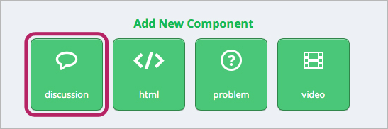
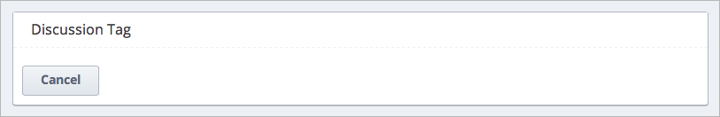
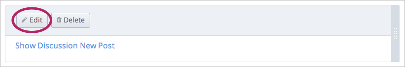
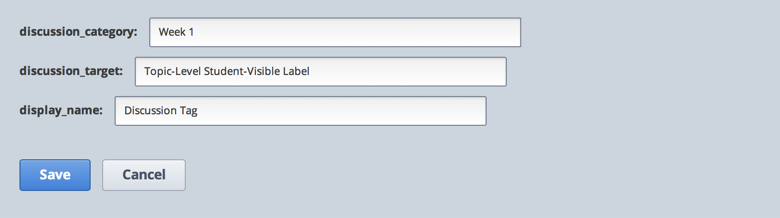
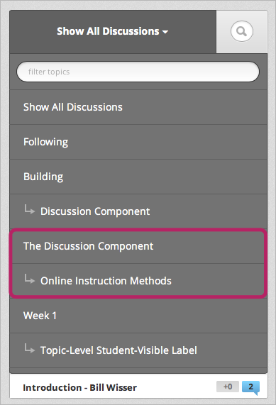

******************* 
創建一個討論 
*******************

要在您的課程裡創建一個討論，您需先在Studio中創建問題以及討論組件。 
然後，您可以鼓勵學生在edX或Edge中經由seeding此討論來回應。

創建討論組件
*****************************

當您在創建討論組件時，請將下面的練習銘記在心。

• 請確定你真的想加入討論組件。
• 一但創建，你的論壇，討論類別是立即可見的 
• (就位於您課程的的討論分頁上)，
• 既使它包含被設定為私密的討論組件

• 當你為討論組件創建一個ID時，請千萬要注意—特別是當
• 你正在為一個進行中的課程新增討論組件時。 遵守以下
• 的格式在步驟10以確保此ID在整個edx課程中是獨一無二的

• 只編輯討論組件編輯區上方的欄位。 不要去修改large box中的XML。

新增討論組件:

1. 開啟Studio.

2. Make a note of the **Display Name** of the Subsection you are in and the
**Display Name** of the Unit you are in.

3. At the location in the Unit where you want to start your discussion  :doc:`create_html_component`  
that contains the  question you want students to discuss.

4. Directly under this new HTML component, click **Discussion** under **Add New
Component.**

5. When the following box appears, click **Discussion Tag.**

6. When the following box appears, click **Edit.**

The following editing box opens. You will change the values in the small boxes,
but you will not change the text in the large box.

.. note::

	In the future, these boxes may be filled in for you with a default value.

7. In the **discussion_category** box, type the name of the category that you
want to create for the discussion. You can include spaces.

8. In the **discussion_target** box, type the name of the subcategory that you
want to create for the discussion. You can include spaces.

.. note::
	The category and subcategory names only appear in the discussion forum for
	your course. They do not appear in the discussion space inside the Unit.

For example, if you set **discussion_category** to be “The Discussion Component”
and you set **discussion_target** to be “Online Instruction Methods,” the
category and subcategory appear as follow in the category list in the discussion
forum:

9. In the **display_name** box, type a name for the discussion. The display name
appears when a student hovers the mouse over the ribbon.

10. Click **Save.**

.. raw:: latex
  
      \newpage %

Seed a Discussion Space in Your Course 
**************************************

When you create a discussion, many students may feel hesitant to be the first to
post an answer to your question. You can get the discussion started by posting
your own answer—preferably anonymously or as a student, so that students will be
more comfortable replying if they disagree with your post.

To post as a student, follow the steps below. If you later want to reply as
yourself, log back into your usual account and omit steps 1 and 2.

1. Set up a test account on edX or Edge with an e-mail address that is not
associated with your Course Team.

2. Go to your course URL and register for your course.

3. On edX or Edge, locate the Unit that contains the Discussion component.

4. In the Unit, locate the discussion space.

5. Click **New post.**

6. Type a title for your post in the Title box, and then enter text for your
post.

7. If you want to, select the **post anonymously** check box or the **follow
this post** check box.

8. When you are satisfied with your post, click **Add Post.**

Your new post appears at the top of list in the unit. Posts are listed in
reverse chronological order.

