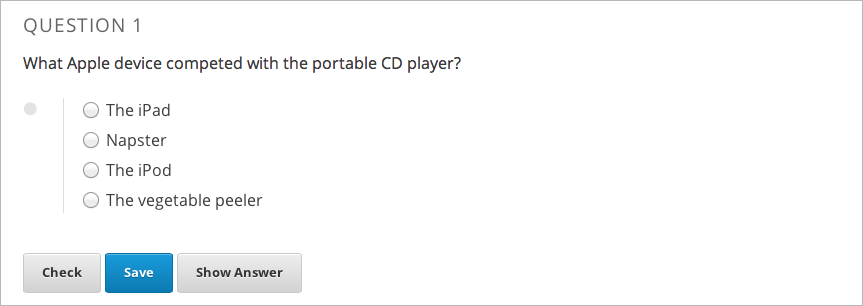
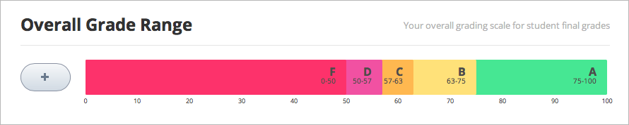
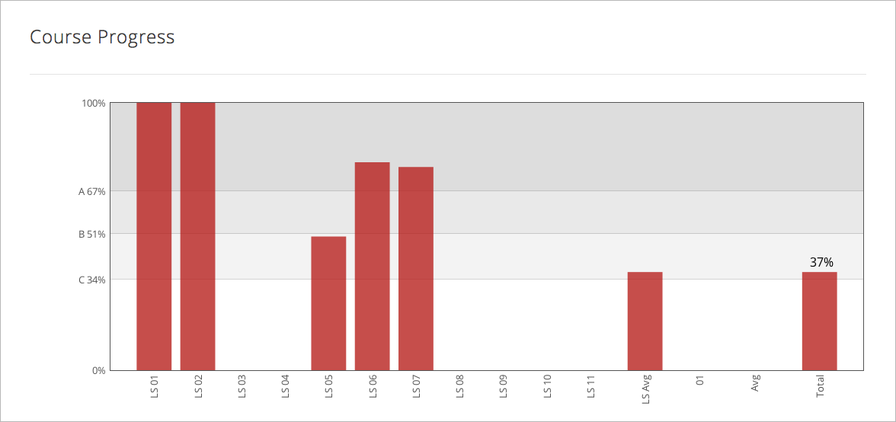
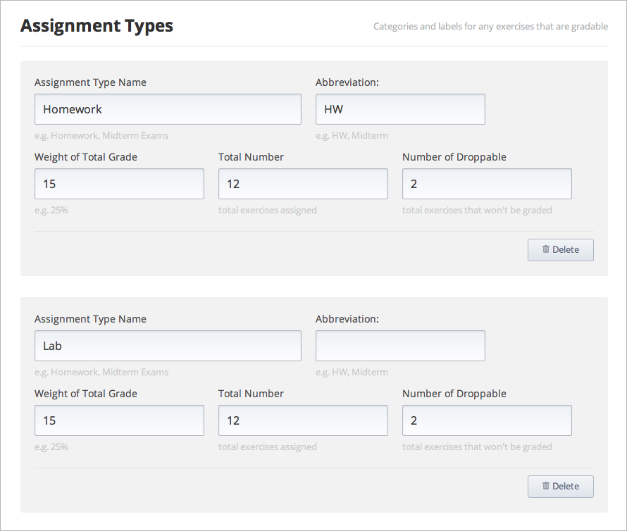
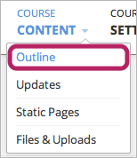
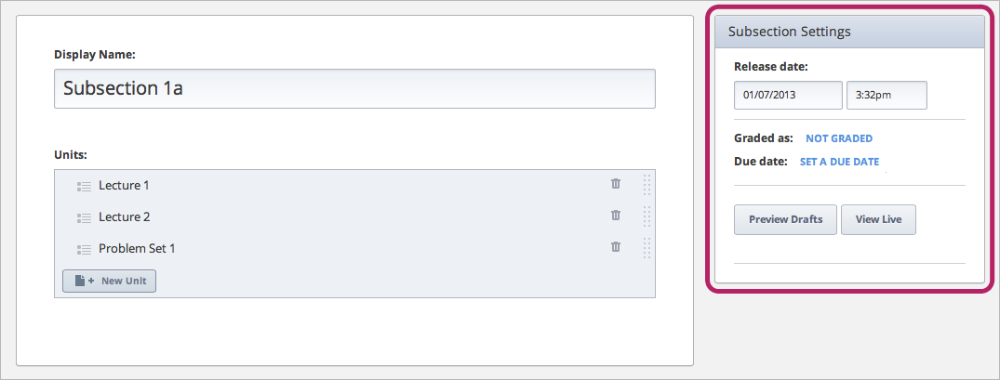
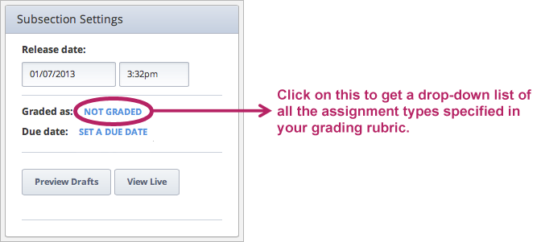
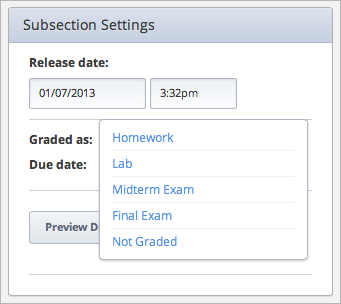
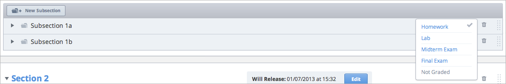

***************************
建立Grading Policy  
***************************
  

Overview 
********
  
  
在edX中的成績是基於assignment以及exam。
  
  
在edX Studio中設定成績需要許多步驟。 這些步驟將會在接下來的課程中詳細解釋。
要跳到詳細資訊，點擊下面的連結。 
  

1. 建立一個overall grading policy，也見 :ref:`Set Grade Brackets<Set-Grade-Brackets>`.
          
.. image:: Images/image139.png
  
This is done at the course level in the **Course Settings** menu.
  
          
建立是否你的課程是pass-fail或graded by letter，及各個分數的threshold為何。
     
          
創建課程的assignment類型以及確定weight of the student's total grade for each assignment type。 例如，你有10個assignment，占成績的50%; 3次exam，占成績的10%; 和1個final exam，占成績的20%。 預設下，當你創建課程時，Studio 包含4種assignment類型: homework, lab, midterm exam, and final exam。你也可以
創建額外的assignment類型，像是quizzes。
    
            
2. 在body of the course裡創建一個包含graded assignments的subsections， 
見 :ref:`Create Subsections that Contain Graded Assignments<Create-Graded-Subsections>`.
              

.. image:: Images/image135.png

你課程中的每一個subsection都可被劃定為你在grading policy指定的assignment types的其中一種。
你也可以指定發佈日期以及截止日期。
  
  
.. note::
	
		你可以在Studio中創建problems而不必指定subsection為assignment type。 然而， problems do not count toward a student's grade unless you set the subsection as a graded assignment type.

有關creating problems的更多資訊，見 `Create a Problem <Create_Problem.html>`_ . 
 
3. 在assignment subsections中，創建個別的problems 

  
  
你可以為這些problems建立設定  (including the number of attempts a student has and the problem's point value, or weight).  

Once a grading policy is in place, students can view both their problem scores and the percent completed and current grade at the top of their  **Progress** tab for the course.
  
此外，做為instructor，你也能在graded content存取你學生的分數。在Edge上你的課程的live published page(not from the Preview page in Studio)，點擊 **Instructor** 分頁。 出現許多選項用於觀看或下載snapshot of the currently stored student grades。 在 **Instructor** 分頁你也可要求觀看student's individual progress page的連結，包括graded及not graded scores。 更多資訊，見 Progress and Certificates.

  
.. _Set-Grade-Brackets:

Set Grade Brackets 
++++++++++++++++++ 
  
設定course grades的thresholds:
    
1. 在navigation bar，點擊 **Course Settings**，接著點擊 **Grading**。
  
2. 在 **Overall Grade Range**，點擊並拖曳grade divisions之間的dividing line以移動threshold上下。
  
.. note::

	預設的grade divisions為Pass and Fail。 要增加更多grade divisions (比如A, B, C, or D)，點擊加號(+).
    
  

要移除grade division，用滑鼠滑過grade division (shown above) 接著點擊出現在grade division上的 **Remove** 連結。

.. _Set-Grace-Period:
設定Grace Period 
++++++++++++++++++
    
你可以為學生設定grace period用於擴充homework due dates。 注意此設定會套用到整個課程;
你無法為個別的assignments設定grace period。
  
  
1. 在navigation bar，點擊 **Course Settings**，接著點擊 **Grading**。
  
  
2. 在 **Grace Period on Deadline** box中的 **Grading Rules & Policies** 輸入數值。
  
  
創建Assignment Types
+++++++++++++++++++++++  
  
  
預設上，當你創建課程時，Studio 包含4種assignment類型: homework, lab, midterm exam, and final exam. 
你設定每個assignment type對student's total grade占的比重。
  
  
要設定一個assignment type:
  
  
1. 在navigation bar，點擊 **Course Settings**，接著點擊 **Grading**。
  
  
2. 在 **Assignment Types**，找到你要的assignment type設定。
  
  
若你想要創建新的assignment type，捲動到頁面底部，點擊 **New Assignment Type**。
  
  
3. 輸入下列boxes中的數值。
  
  
**Assignment Type Name:** 
這是assessment的一般分類 (homework, exam, exercise)。所有有一樣assignment type的assignments有一樣的weight。
學生能看到這個。
  
  
**Abbreviation:** 
這是會顯示在學生的**Progress** 分頁旁的短名(see below)。
  

      
  
**Weight of Total Grade:** 
The assignments of a particular type together account for the percent value set in **Weight of Total Grade**.
  
  
**Total Number:** 
The number of assignments of that type that you plan to present in your course.
  
  
**Number of Droppable**
(optional): Specify the number of assignments that the grader will drop. The grader will omit the lowest-scored assignments first.
  
  
For example, the following course has two types of assignments. The overall course grade is broken down as 40% Homework and 60% Final Exam. There are eight Homework assignments, and the grader will omit the lowest-scored assignment from the final grade. Thus, the seven remaining Homework assignments are each worth 40 7 = 5.8% of the final grade.
  

          
Troubleshooting
+++++++++++++++
   
If you have problems creating assignment types, try the following.
        
In the **Weight of Total Grade** field, omit the % sign. Be sure that your **Weight of Total Grade** fields add up to 100.
    
.. _Create-Graded-Subsections:  

.. raw:: latex
  
      \newpage %

Create Subsections Containing Graded Assignments
**************************************************
   
After you establish your grading rubric, you can create a graded assignment or a test for your students. To do this, you must first create a subsections and then set up grading for the subsection. This includes setting the assignment type, the assignment release date, and the due date.
  

.. note::

	When you set a due date, keep in mind that students will be in different time zones across the world. By default, the time zone appears as UTC-not the student's local time. If you tell your students an assignment is due at 5:00 PM, make sure to specify that the time is 5:00 PM UTC and point them to a time converter.
      
  
Alternatively, you can :ref:`set a grace period<Set-Grace-Period>` for your assignments to cover any misunderstandings about time. For example, some classes have set a grace period of 1 day, 6 hours, and 1 minute. This grace period applies to the entire course. 
      
Keep in mind that a subsection can only have one assignment type. If you want to create a homework assignment and a lab for a specific topic, you would create two subsections for that topic. You would set one subsection as the Homework assignment type and the other as the Lab assignment type. Both subsections can contain other content as well as the actual homework or lab problems.
  
  
All assignments of a particular type are automatically worth the same amount. Thus, a homework assignment that contains 10 problems is worth the same percentage of a student's grade as a homework assignment that contains 20 problems. If you want the assignment with 20 problems to be worth twice as much as the assignment with 10 problems, you can create two assignments.
  
  
1. On the navigation bar, click **Course Content**, and then click **Outline**.
  
  

      
2. Under **Course Outline**, locate the section where you want to add an assignment.
  
3. Under the name of the section, click **New Subsection**.
       
4. In the text box, replace **New Subsection** with the name of your subsection, and then click **Save**.
      
Click the subsection you want. The edit page for the subsection opens. In the top right corner of the page, locate the **Subsection Settings** box.

      
Set the assignment type. To do this, locate the blue link next to **Graded as**. Because all subsections are set to  **Not Graded** by default, the text for this link is **NOT GRADED**.

    
Click this link to open a list of the assignment types that you specified in your grading rubric, and then click the assignment type that you want.
  
  

Set the assignment's release date and time. To set the date, click inside the **Release date** field, and then select the date that you want in the calendar that appears. To set the release time, click inside the time input field, and then specify the time you want.
       
Set a due date for the assignment. To do this, click the blue **SET A DUE DATE** link, and click inside the **Due date** box, and then select the date you want in the calendar that appears. To set the time, click inside the time input field, and then specify the time you want.

Change a Subsection's Assignment Type
+++++++++++++++++++++++++++++++++++++    
  
To set the assignment type for a subsection:
  
1. On the navigation bar, click **Course Content**, and then click **Course Outline**.

2. Under **Course Outline**, locate the subsection that you want.
  
3. On the right side of the screen, click the blue check mark for the subsection, and then select the assignment type.
  

.. note::

	If you change an assignment type name in the Grading page, make sure the assignment type names on the Course Outline still match.
